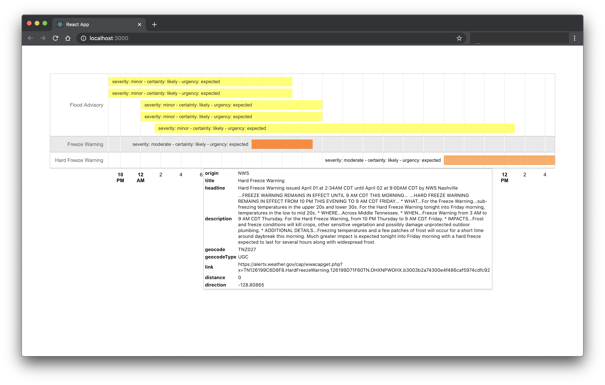

Events Dashboard
========

#### Events Dashboard using Tomorrow.io API ####
Want to build your very own [Insights Dashboard](https://www.tomorrow.io/software/)? Use our [/events endpoints](https://docs.tomorrow.io/reference/events-overview) with either [custom insights](https://docs.tomorrow.io/reference/insights-overview) or our [category collection](https://docs.tomorrow.io/reference/insights-categories-overview).

### What's Included ###
Single page React app that shows forecasted weather events for a single location, based on [Google's Charts](https://developers.google.com/chart) [Timeline component](https://react-google-charts.com/timeline-chart).

> Note: This app uses the key on the clients-side React web app, but it is recommended to secure it by having a proxy backend service calling the Tomorrow.io API

### Usage ###
This project was bootstrapped with [Create React App](https://github.com/facebook/create-react-app) - head over to this amazing project to learn more on how to kickoff the work.

### Contributors ###
This project exists thanks to our engineers building the [Tomorrow.io Weather API](https://tomorrow.io).

### License ###
Licensed under the [MIT License](./LICENSE) license.
